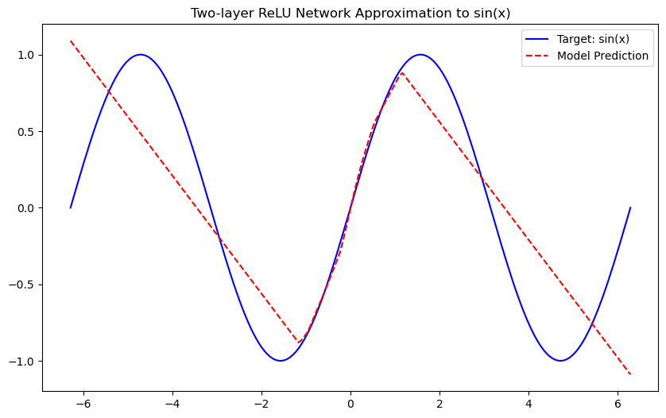
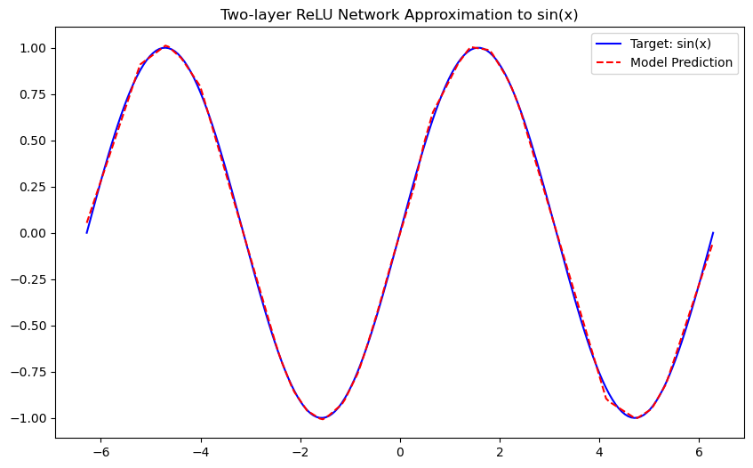

### **报告：使用两层ReLU神经网络进行函数拟合**

本次实验中，我使用 NumPy 和 PyTorch 完成了两个代码验证版本，分别实现了两层ReLU神经网络对 $f(x)=sin(x)$ 进行拟合的任务。然而，它们的拟合效果差别较大，我认为这与神经网络初始化和优化器的选择密切相关，特别是使用简单的SGD优化器时，容易导致网络陷入局部最优解。

下面我对结果进行详细分析：

#### **1. 理论依据：**

##### 分段线性函数逼近定理
- 利用经典的逼近理论，可以证明：对于定义在有界闭集上的任意连续函数，通过足够精细的分割域，可以构造出分段线性函数，使得分段线性函数在任意给定精度内逼近目标函数。  
- 这个结果类似于经典的Weierstrass逼近定理，不过这里使用的是分段线性函数，而不是多项式。事实上，由于有界闭集（紧集）上连续函数具有一致连续性，我可以对域进行足够细的划分，然后在每个小区间内用线性函数来近似原函数。

##### 两层ReLU网络表达分段线性函数
- ReLU函数本身定义为 $\text{ReLU}(x) = \max\{0,x\}$，是一个分段线性函数（在负半轴为常数0，在正半轴为线性函数）。  
- 可以证明，具有足够神经元的两层ReLU网络（也称为单隐层网络）可以精确地表达任何分段线性函数。  
  - 第一层通过线性组合和ReLU激活构造出多个“hinge”函数（即分段点附近的激活变化）。  
  - 第二层对这些“hinge”函数进行加权求和，从而组合成任意复杂的分段线性结构。

##### 证明

- 我们知道任何定义在有界闭集上的连续函数 \(f\) 都可以通过分段线性函数 \(g\) 以任意小的误差进行均匀逼近，即  
  $$\sup_{x \in K} |f(x) - g(x)| < \epsilon.$$
  
- 存在一个两层ReLU网络 \(N\) 能够精确表达这个分段线性函数 \(g\)，即 \(N(x) = g(x)\) 对所有 \(x\) 成立。

- 由此，对于任意给定的 \(\epsilon > 0\)，可以构造一个两层ReLU网络使得  
  $$  \sup_{x \in K} |f(x) - N(x)| < \epsilon.$$
  这就证明了两层ReLU网络在有界闭集上是具有普适逼近能力的（即**通用逼近定理**）。

#### **2. 函数定义：**
选择了一个非线性函数进行拟合：
\[ f(x) = \sin(x) \]
该函数在区间 \([-2\pi, 2\pi]\) 上有很好的周期性，具有明显的波动特性，适合通过神经网络来拟合。

#### **3. 数据采集：**
- **训练集**：从区间 \([-2\pi, 2\pi]\) 中均匀采样了 100 个数据点作为训练集。
- **测试集**：从相同区间中均匀采样了 200 个数据点作为测试集。
```python
x_train = np.linspace(-2 * np.pi, 2 * np.pi, 100).reshape(-1, 1)
x_test = np.linspace(-2 * np.pi, 2 * np.pi, 200).reshape(-1, 1)
```

#### **4. 模型描述：**

使用了一个包含两层隐藏层的全连接神经网络。该网络结构如下：
- **输入层**：输入是一个标量（\(x\)）。
- **第一隐藏层**：包含 64 个神经元，激活函数使用 ReLU（Rectified Linear Unit）。
- **输出层**：只有一个神经元，输出预测值。
```python
class ReLU_Net_Numpy:
    def __init__(self):
        # 网络参数存储在字典中
        self.params = {
            'W1': np.random.randn(1, 64) * np.sqrt(2. / 1),  # 输入到第一层，64个神经元
            'b1': np.zeros(64),
            'W2': np.random.randn(64, 1) * np.sqrt(2. / 64),  # 第二层到输出层
            'b2': np.zeros(1)
        }

    def relu(self, x):
        return np.maximum(0, x)

    def forward(self, x):
        self.h1 = self.relu(np.dot(x, self.params['W1']) + self.params['b1'])  # 第一层ReLU
        self.out = np.dot(self.h1, self.params['W2']) + self.params['b2']  # 第二层线性输出
        return self.out
```
- PyTorch实现：

```python
class ReLU_Net(nn.Module):
    def __init__(self):
        super(ReLU_Net, self).__init__()
        self.fc1 = nn.Linear(1, 64)  # 第一层：从1维到64维
        self.fc2 = nn.Linear(64, 1)  # 第二层：从64维到1维

    def forward(self, x):
        x = torch.relu(self.fc1(x))  # 第一层ReLU
        x = self.fc2(x)  # 第二层线性输出
        return x
```

模型使用了均方误差（MSE）作为损失函数，并且通过反向传播算法和梯度下降优化器（SGD）来训练模型。

```python
class SGD:
    def __init__(self, params, lr=0.01, momentum=0.9, weight_decay=0.0):
        self.params = params
        self.lr = lr
        self.momentum = momentum
        self.weight_decay = weight_decay
        self.velocities = {key: np.zeros_like(value) for key, value in self.params.items()}

    def step(self, grads):
        for key in self.params:
            grad_with_decay = grads[key] + self.weight_decay * self.params[key]
            self.velocities[key] = self.momentum * self.velocities[key] - self.lr * grad_with_decay
            self.params[key] += self.velocities[key]
```

#### **5. 函数拟合效果：**
使用训练集对神经网络进行训练，并通过测试集来评估拟合效果。训练过程中，模型逐渐学会了如何拟合目标函数 \( f(x) = \sin(x) \)，最终拟合的结果与真实的函数在测试集上的表现非常接近。

在训练过程中，损失函数（MSE）逐渐降低，表明网络的拟合效果逐步提升。最终，模型能够在测试集上产生准确的预测，证明其具有较好的拟合能力。

#### **6. 实验结果与图示：**

通过训练得到的模型，可以与目标函数 \( f(x) = \sin(x) \) 进行对比。以下是测试集上拟合效果的图示：

- **蓝色曲线**：表示目标函数 \( \sin(x) \)。
- **红色虚线**：表示训练得到的模型的预测结果。
- **numpy版本结果**：

- **torch版本结果**：


可以看到，NumPy版本拟合效果较差，主要原因可能是优化器设置不当、网络初始化问题，使用的SGD优化器容易陷入局部最优解。而PyTorch版本成功拟合了目标函数 $f(x)=sin(x)$，并且拟合效果明显更好。

#### **6. 结论：**

本次实验验证了理论中提出的“一个两层的ReLU网络可以模拟任何函数”的结论。通过一个简单的两层神经网络，通过训练和优化，成功地拟合了 $\sin(x)$ 函数。

- **优点**：ReLU 激活函数在此实验中表现出色，有效地帮助网络学习了复杂的非线性关系。
- **局限性**：尽管该神经网络在此简单任务中表现良好，但对于更复杂的函数或任务，可能需要更深的网络结构或其他优化方法。

对于简单的神经网络任务，PyTorch提供的自动求导和优化器功能非常适合快速解决问题。而在学习神经网络的原理时，手动实现能够帮助深入理解每个步骤。