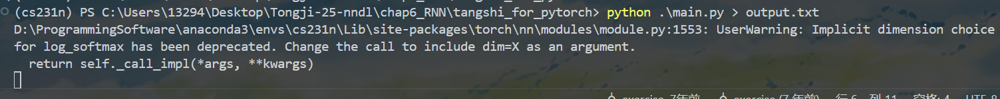
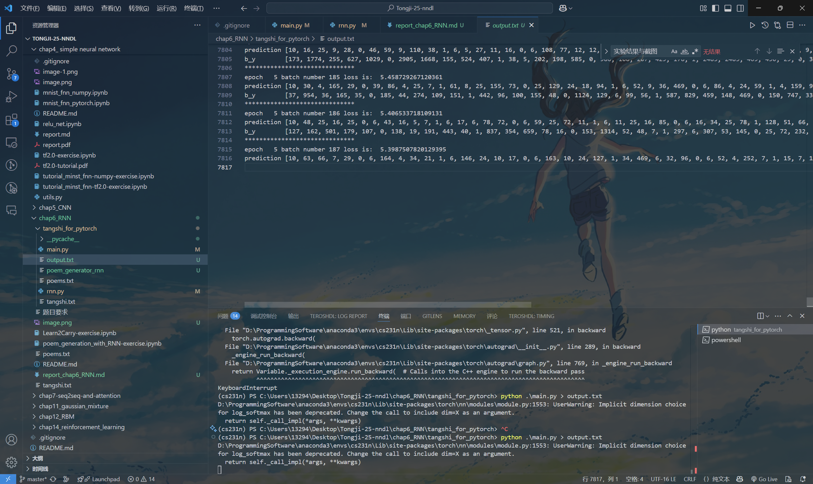
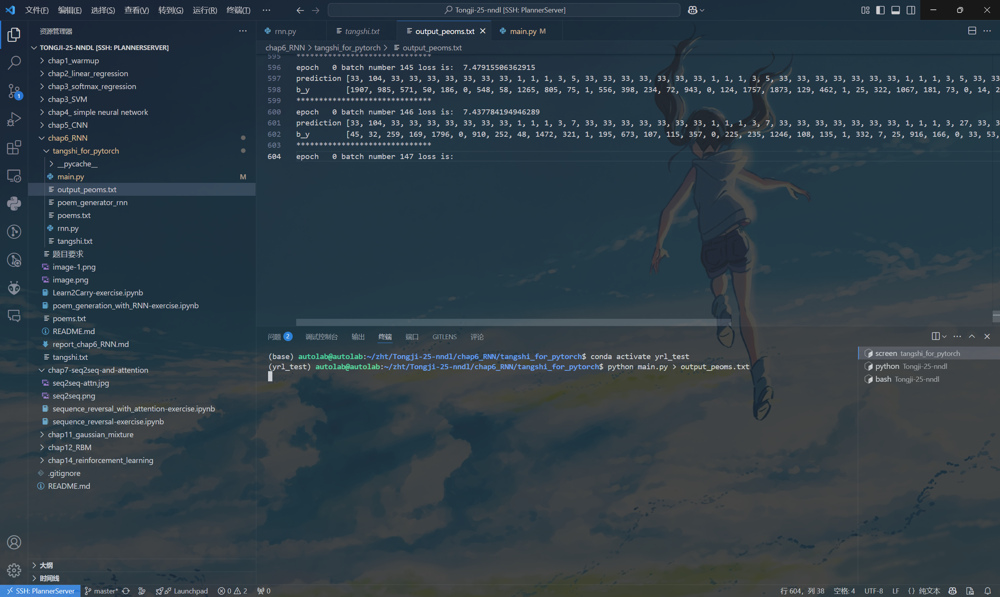
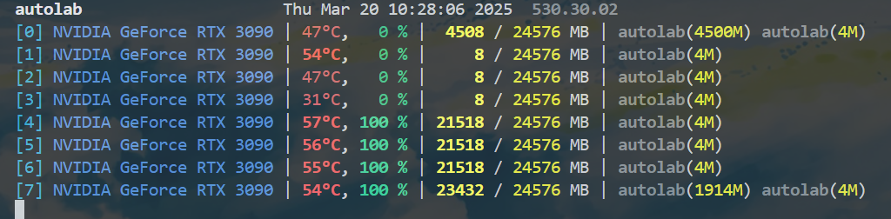

# RNN实验报告

## 1. 作业内容

本次作业主要完成以下任务：
1. 补全程序代码（选择 PyTorch 版本），包括：
   - 在 `RNN_model` 类中完成 LSTM 层的定义和前向传播代码。
   - 在训练过程中添加记录损失并生成训练损失曲线图片的代码。
   - 实现基于训练好的模型生成诗歌的代码，其中初始词包括 “日”、“红”、“山”、“夜”、“湖”、“海”、“月”等。
2. 解释RNN、LSTM和GRU模型的原理和特点。
3. 详细叙述诗歌生成的过程。
4. 生成诗歌，并将生成过程中的训练截图和生成结果截图附在报告中。

## 2. 模型介绍

### 2.1 循环神经网络（RNN）
- **基本原理**：  
  RNN 是一种处理序列数据的神经网络。它通过循环结构将前一时刻的隐藏状态传递给下一时刻，从而捕捉序列中前后信息之间的依赖关系。
- **局限性**：  
  在较长序列中，由于梯度消失或爆炸问题，RNN 难以捕捉长程依赖信息。

### 2.2 长短时记忆网络（LSTM）
- **基本原理**：  
  LSTM 是为解决普通 RNN 梯度消失问题而设计的，其核心在于引入了三个门控结构：输入门、遗忘门和输出门。
- **门控机制**：  
  - **遗忘门（Forget Gate）**：决定遗忘多少上一个时刻的信息。  
  - **输入门（Input Gate）**：决定当前输入信息有多少被存储。  
  - **输出门（Output Gate）**：决定如何将隐藏状态输出。
- **优势**：  
  能够捕捉长程依赖关系，适用于序列生成任务，如诗歌生成。

### 2.3 门控循环单元（GRU）
- **基本原理**：  
  GRU 是一种简化版的 LSTM，将输入门和遗忘门合并为更新门，并引入重置门，从而减少参数量。
- **优势**：  
  结构更简单，计算效率更高，在某些任务上效果与 LSTM 相当甚至更好。

## 3. 诗歌生成过程

### 3.1 数据预处理
- **原始数据**：  
  从文本文件（如 `poems.txt` 或 `tangshi.txt`）中加载诗歌，每首诗在加载时加入起始符（`G`）和结束符（`E`）。
- **清洗处理**：
  对诗歌进行字符清洗，剔除不合适的标点和字符，并按诗句长度进行排序
- **词汇统计**：
  统计所有诗中字符的出现频次，根据词频生成词汇表，并进行词与索引之间的映射。词汇表的生成在语言模型中有重要作用。一个好的词汇表应该表现出词语之间的关联。这里进行词汇排序的作用是，让这些词获得较低的索引值，确保同一数据集在不同阶段的一致性，便于后续查询和预处理。

### 3.2 模型构建
- **词嵌入层**：
词嵌入层将一个词索引序列转换为词向量序列，核心操作是利用 `nn.Embedding` 的查表操作，将每个索引映射为一个固定维度的向量表示，详细步骤如下：
  - 在构造函数中生成一个大小为 `[vocab_length, embedding_dim]` 的随机矩阵（数值范围为 -1 到 1），这个矩阵就是词向量的初始值  
    ```python
    w_embeding_random_intial = np.random.uniform(-1,1,size=(vocab_length ,embedding_dim))
    ```
  - 使用 `nn.Embedding(vocab_length, embedding_dim)` 创建一个嵌入层，内部维护一个权重矩阵，大小和上面生成的矩阵相同
   ```python
   self.word_embedding = nn.Embedding(vocab_length,embedding_dim)
   ```
  - 将随机生成的矩阵转换为 PyTorch 张量，复制到 `nn.Embedding` 层的权重中。这样，嵌入层的每一行就对应一个词的初始向量表示。  
   ```python
   self.word_embedding.weight.data.copy_(torch.from_numpy(w_embeding_random_intial))
   ```
  - 在 `forward` 方法中，输入 `input_sentence` 是一个包含词索引的张量。当将这个张量传入 `self.word_embedding` 时，嵌入层会查找内部权重矩阵中对应索引的行，并返回相应的词向量。  
   ```python
   sen_embed = self.word_embedding(input_sentence)
   ```

```python
class word_embedding(nn.Module): # 定义词嵌入模块
    def __init__(self,vocab_length , embedding_dim):
        super(word_embedding, self).__init__()
        w_embeding_random_intial = np.random.uniform(-1,1,size=(vocab_length ,embedding_dim))
        self.word_embedding = nn.Embedding(vocab_length,embedding_dim)
        self.word_embedding.weight.data.copy_(torch.from_numpy(w_embeding_random_intial))
    def forward(self,input_sentence):
        """
        :param input_sentence:  a tensor ,contain several word index.
        :return: a tensor ,contain word embedding tensor
        """
        sen_embed = self.word_embedding(input_sentence)
        return sen_embed
```
- **LSTM 模型**：
使用两层 LSTM 模型对词向量序列进行建模，通过循环结构捕捉诗歌中的时序信息。LSTM 的输出经过全连接层和 LogSoftmax 激活后，得到每个时刻各个词的概率分布

- **全连接层**
定义全连接层，将 LSTM 的输出映射到词汇表大小的维度，用于后续预测下一个词

- **权重初始化**：
使用 Xavier 均匀初始化（只对全连接层进行初始化），确保模型初始状态下输出的方差合适，有助于梯度传播和稳定训练

```py
def weights_init(m):
    classname = m.__class__.__name__  # obtain the class name
    if classname.find('Linear') != -1:
        weight_shape = list(m.weight.data.size())
        fan_in = weight_shape[1]
        fan_out = weight_shape[0]
        w_bound = np.sqrt(6. / (fan_in + fan_out))
        m.weight.data.uniform_(-w_bound, w_bound)
        m.bias.data.fill_(0)
        print("inital  linear weight ")
```

### 3.3 模型训练
- **批量数据生成**：  
  将诗歌数据划分为若干 batch，每个 batch 中的诗歌统一长度，通过截断或补齐确保输入形状一致。
  ```py
  batches_inputs, batches_outputs = generate_batch(BATCH_SIZE, poems_vector, word_to_int)
  batch_x = batches_inputs[batch]
  batch_y = batches_outputs[batch] # (batch , time_step)
  ```
- **前向传播**：  
  对每个 batch，模型将输入诗歌序列转换为嵌入向量，然后送入 LSTM 模型，最后经过全连接层和激活函数计算预测分布。
  ```py
  for batch in range(n_chunk):
      loss = 0
      for index in range(BATCH_SIZE):
          x = np.array(batch_x[index], dtype = np.int64)
          y = np.array(batch_y[index], dtype = np.int64)
          x = Variable(torch.from_numpy(np.expand_dims(x,axis=1)))
          y = Variable(torch.from_numpy(y ))
          pre = rnn_model(x)
  ```
- **损失计算**：  
  使用负对数似然损失（NLLLoss）计算预测词与真实词之间的误差。
  ```py
  loss_fun = torch.nn.NLLLoss()
  loss += loss_fun(pre , y)
  ```
- **反向传播与梯度裁剪**：  
  计算梯度后使用 `torch.nn.utils.clip_grad_norm_` 对梯度进行裁剪，防止梯度爆炸。
  ```py
  optimizer.zero_grad()
  loss.backward()
  torch.nn.utils.clip_grad_norm_(rnn_model.parameters(), 1)
  optimizer.step()
  ```
- **损失记录与保存**：  
  每个 batch 的损失被记录下来，训练过程中每隔若干 batch 保存一次模型参数，同时绘制并保存训练损失曲线
  ```py
  print("epoch  ",epoch,'batch number',batch,"loss is: ", loss.data.tolist())
  loss_history.append(loss.data.item())  # 记录每个 batch 的损失
  ```

### 3.4 诗歌生成
- **生成过程**：
  1. 设定起始词（如“日”、“红”、“山”、“夜”、“湖”、“海”、“月”等）。
  2. 利用训练好的模型，依次生成下一个字符：  
     - 将已生成的诗作为输入，经过模型得到下一个字符的概率分布。
     - 根据概率分布选择最可能的字符，添加到诗句中。
  3. 当生成的字符为结束符或诗句达到一定长度时停止生成。
- **结果展示**：  
  对于每个指定的起始词，通过生成函数 `gen_poem` 得到完整诗歌，并调用 `pretty_print_poem` 对生成结果进行美化打印。
  ```py
  pretty_print_poem(gen_poem("日"))
  pretty_print_poem(gen_poem("红"))
  pretty_print_poem(gen_poem("山"))
  pretty_print_poem(gen_poem("夜"))
  pretty_print_poem(gen_poem("湖"))
  pretty_print_poem(gen_poem("湖"))
  pretty_print_poem(gen_poem("湖"))
  pretty_print_poem(gen_poem("君"))
  ```

## 4. 实验结果与截图

### 4.1 训练过程截图
- 训练过程截图,cpu:



- 由于cpu训练太慢，后面改成GPU运行，使用screen后端运行


修改代码为
```py
gpu_id = "7"
os.environ["CUDA_VISIBLE_DEVICES"] = gpu_id
device = torch.device("cuda" if torch.cuda.is_available() else "cpu")
```
并将模型和数据'.to(device)'

- 记录每个batch的平均损失，并通过matplotlib绘制训练损失曲线。如下图所示：
<!--    -->
*（图中展示了训练过程中损失值随 batch 变化的趋势）*

### 4.2 生成诗歌示例
下列为使用不同起始词生成的诗歌示例，有些失败了

  ```
  inital  linear weight 
  inital  linear weight 
  自知终岁后，何必在天中。
  inital  linear weight 
  inital  linear weight 
  夜魏古今年别，一行无事在人间。
  风光一望无人事，一半黄金作上天。
  inital  linear weight 
  inital  linear weight 
  inital  linear weight 
  inital  linear weight 
  何人得相见，一望一何如。
  ```

## 5. 实验总结

本次实验从数据预处理、模型构建、训练到诗歌生成，完整实现了一个基于 LSTM 的诗歌生成系统。  
**总结如下：**
- **数据预处理**：数据清洗、词汇统计和批量生成是后续训练的重要基础；数据质量直接影响生成效果。
- **模型构建**：利用两层 LSTM 能较好捕捉诗歌的时序信息，通过全连接层和 LogSoftmax 得到预测分布；权重初始化采用 Xavier 均匀初始化，有助于模型收敛。
- **训练过程**：引入梯度裁剪避免梯度爆炸，并记录训练损失以观察模型学习情况。训练过程中模型参数定期保存，方便后续生成时加载。
- **诗歌生成**：基于训练好的模型，通过指定起始词逐步生成完整诗歌。生成效果受训练数据、模型结构和超参数影响，后续可进一步改进。

总体来说，本次实验成功实现了诗歌生成的基本流程，并通过实验结果验证了 LSTM 模型在处理序列生成任务中的有效性。接下来，可以考虑进一步优化模型结构（例如尝试 GRU 或混合模型）以及扩充训练数据，以期生成更加优美和符合意境的诗歌。


